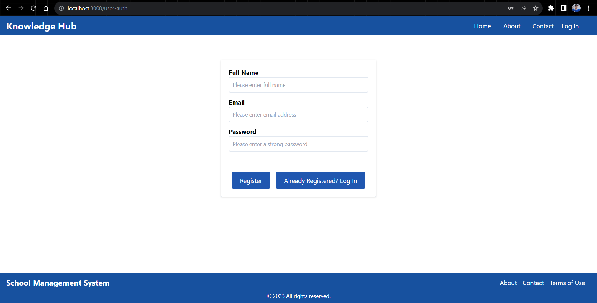

# School - Library Management App

This is a comprehensive web application designed to streamline school operations. Leveraging the power of modern technologies such as Next.js, TypeScript, React, Redux, Redux-Toolkit, Tailwind CSS, Node.js, Express, and PostgreSQL, the School Library Management App offers a wide range of features to enhance efficiency and organization within educational institutions.
Features

User Authentication: Ensure secure user registration and login functionality to protect sensitive data.

##Dashboard: Enjoy a user-friendly dashboard that provides an overview of key metrics, enabling administrators to monitor important aspects of the school library system at a glance.

##Student Management: Effortlessly manage student information by adding, editing, and removing student records. Keep track of essential details and updates in real-time.

##Book Management: Seamlessly handle the school's book inventory. Monitor book availability, track details, and manage different book categories efficiently.

##Borrowing System: Enable students to easily borrow and return books through an intuitive and organized borrowing system. Keep records of borrowed items for transparency.

##Reporting: Generate insightful reports that offer valuable data insights. Create reports on borrowed books, overdue books, popular genres, and more to support data-driven decision-making.

##Certificate Generation: Streamline the process of creating report-card cum certificates for students. Generate downloadable PDFs that showcase academic achievements.

##Notifications: Implement a notification system to alert students and staff about upcoming due dates, overdue books, and other important library-related announcements.

##Search and Filter: Implement a robust search and filtering system that allows users to quickly locate specific books or student records based on various criteria.

##Multi-User Support: Accommodate various user roles such as administrators, librarians, and students, each with tailored permissions and access levels.

##Tech Stack

##Frontend: Utilize the power of Next.js, a React framework, along with Tailwind CSS for responsive and modern user interfaces. Manage state efficiently with React-Redux.

##Backend: Build a reliable and scalable backend using Node.js and Express.js. Handle API requests, business logic, and data management seamlessly.

##Database: Store and organize data using PostgreSQL, a powerful open-source relational database management system.

## Getting Started

1. Clone the repository:
   git clone https://github.com/Jagamohan-81/library-managment.git
   cd library-managment
